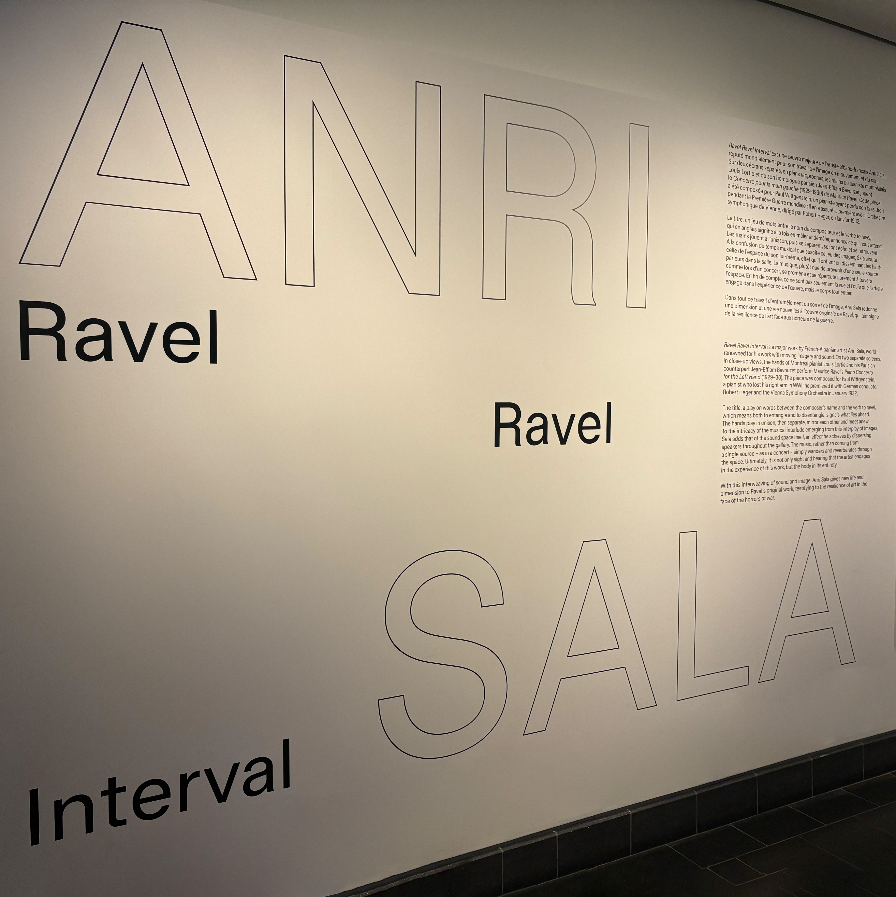
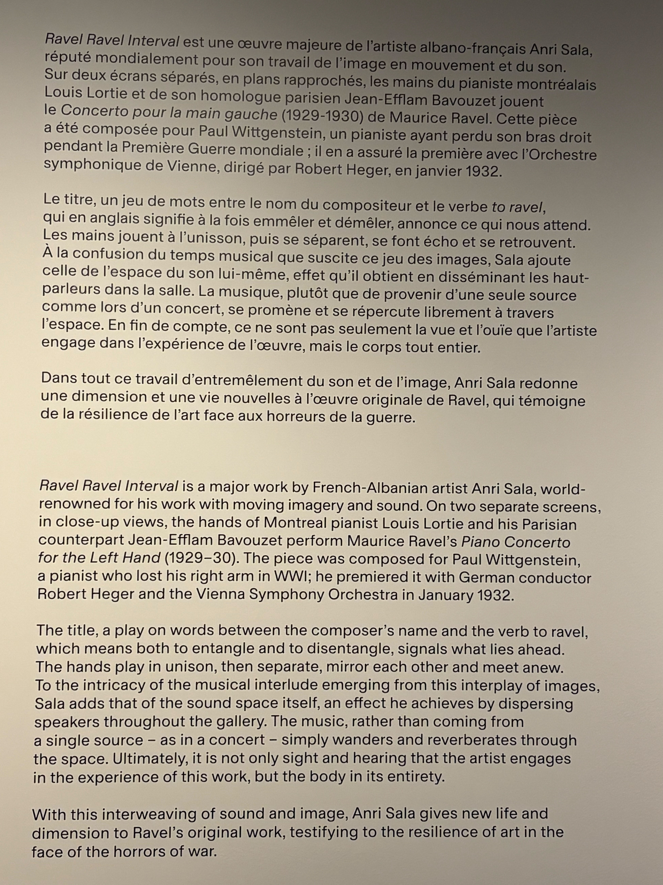
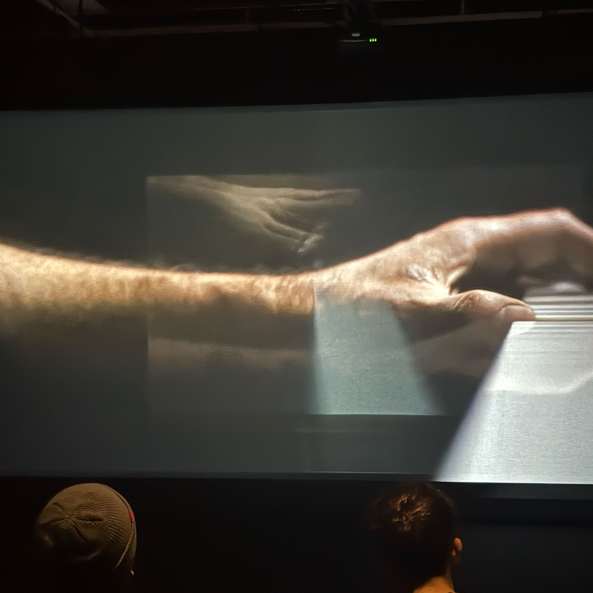
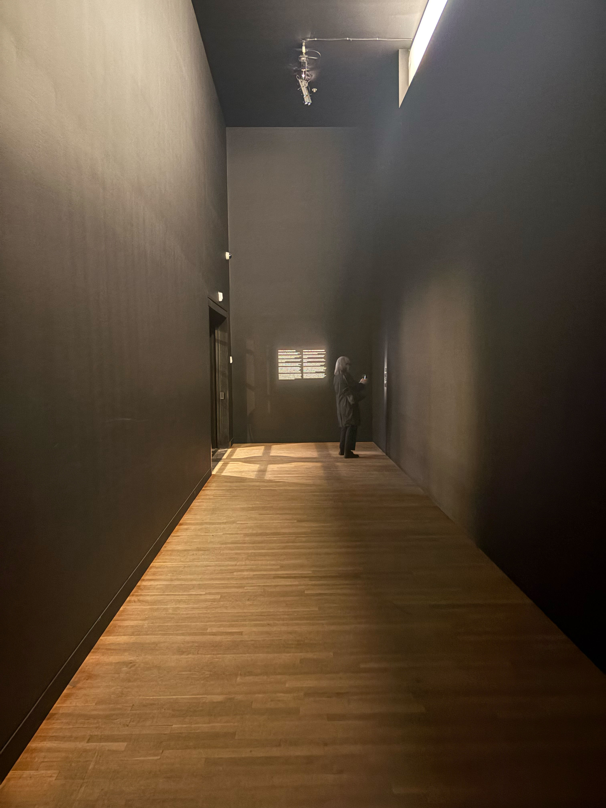
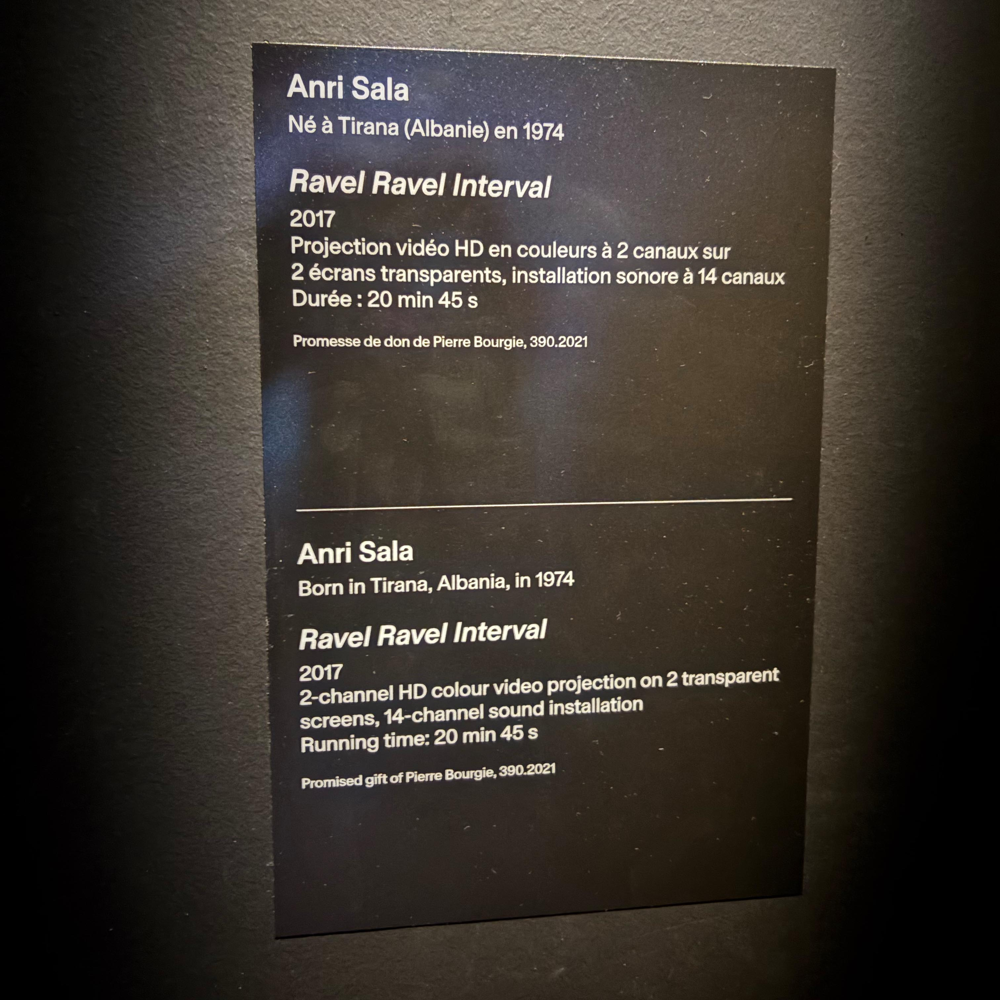
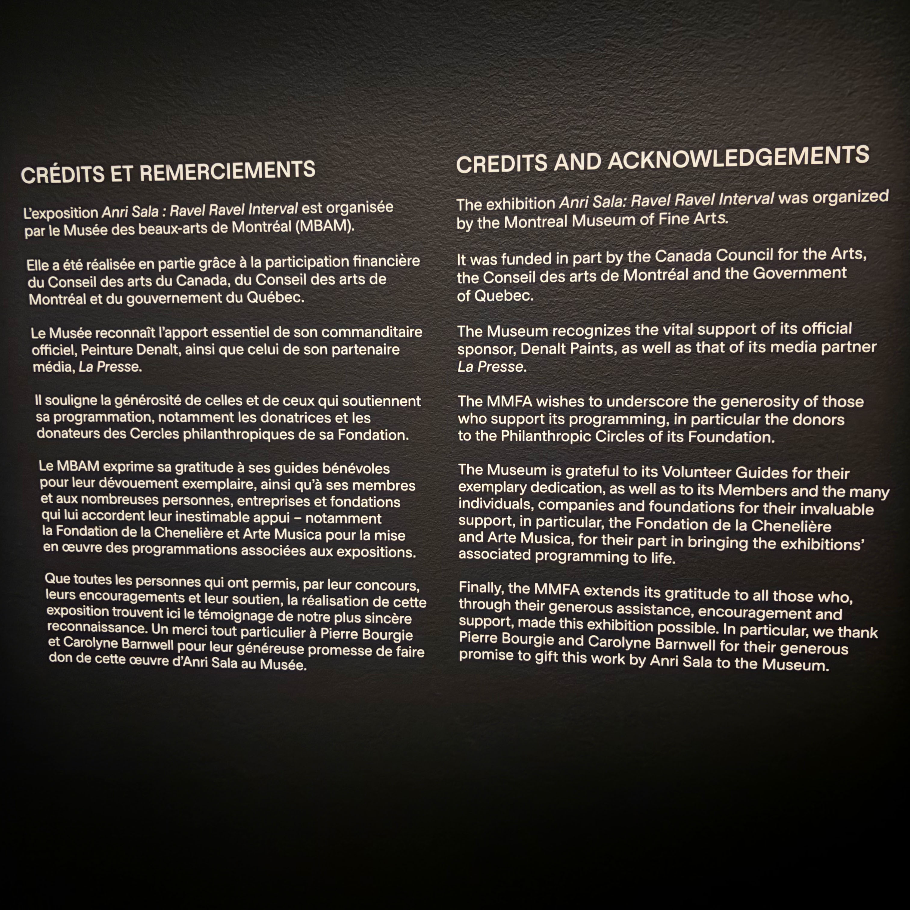

`Date de la visite :` 3 Avril 2025

# Visite et expérience de l'exposition `Ravel Ravel Interval` d'`Anri Sala` Au `Musée des beaux-arts de Montréal`

###### `Photo de Philippe La Brèque, du mur de présentation de l'oeuvre`

###### Source: (Téléphone portable de Philippe La Brèque)

#

###### `Photo de Philippe La Brèque, du texte d'information du mur d'accueil de l'oeuvre`

###### Source: (Téléphone portable de Philippe La Brèque)

#

###### `Photo de Philippe La Brèque, du résultat de l'oeuvre dans l'angle d'observation des spectateurs`

###### Source: (Téléphone portable de Philippe La Brèque)

Ce point de vue est de face afin de contempler le résultat de l'effet de superposition des 2 projections.

#

### `Informations générales`

- Lieu de mise en exposition : `Musée des beaux-arts de Montréal`
- Type d'exposition : `Intérieure & temporaire`
- Type d'installation : `Immersive & contemplative`
- Année de réalisation : `2017`
- 

#

### `Informations sur place`

Suite à la lecture du mur de présentation du dispositif qui se trouve à l'accueil de l'oeuvre, un long corridor sombre et presque vide présente 2 cartels d'information sur `Ravel Ravel Interval`.

###### `Photo de Philippe La Brèque, du corridor d'entrée où se trouvent 2 cartels d'information de l'oeuvre`

###### Source: (Téléphone portable de Philippe La Brèque)
#

#

###### `Photo de Philippe La Brèque, du cartel de l'oeuvre`

###### Source: (Téléphone portable de Philippe La Brèque)

#

###### `Photo de Philippe La Brèque, des crédits et remerciements de l'oeuvre`

###### Source: (Téléphone portable de Philippe La Brèque)

#

### `Appréciation de la conférence`

