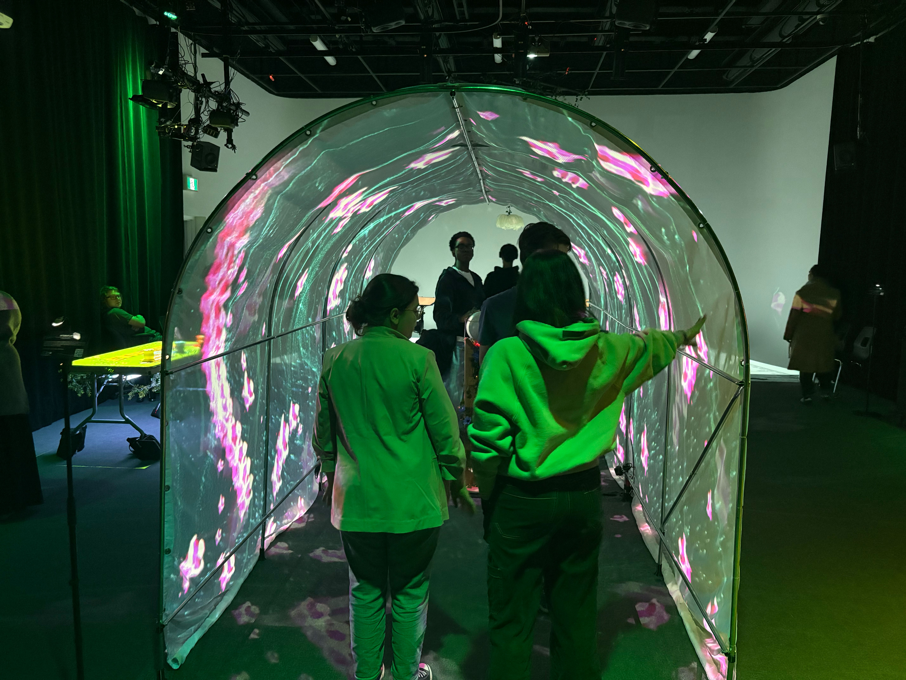
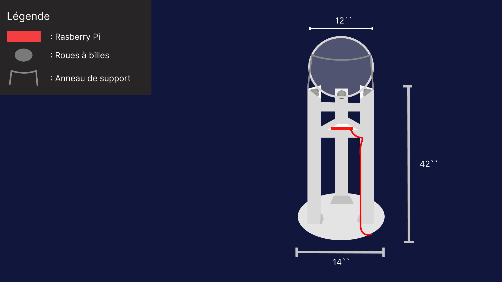

# `INTERNATURE`
### `(Projet favori de l'exposition RÉSONANCE)`

**`Voici la documentation du projet Internature, qui est celui que j'apprécie le plus.`**

# 

###### `Logo du projet Internature` 

#

# Vidéo de présentation
https://youtu.be/gOmRA3XJf-A?feature=shared

#

# INFO

### Année de réalisation :
`2025`

### Réalisé par : 
`Khaly Tia Sing`, `Isaac Fafard`, `Delphine Grenier`, `Sitmonternna Yi` & `Kenza El Harrif`

### Mise en exposition :
`Collège Montmorency`

### Date de la visite :
`17-21 Mars`

### Type d'exposition :
`Temporaire` & `intérieure`

### Type d'installation :
`Contemplative`, `immersive` & `interactive`

#

###### `Installation finale du projet Internature`

#

###### `Cartel du projet Internature` 

#

### Description | Fonction du dispositif : 
`Internature` est une installation qui met en oeuvre un `tunnel immersif` dont la surface est entièrement illuminée par des `projecteurs` et interactive au niveau des parois. De plus, l'environnement synthétique évolue en fonction des interactions des visiteurs sur la `sphère` installée au centre du tunnel qui effectue des rotations sur des `roues à billes` et un `anneau de support`. Dans le but d'assurer une immersion totale, celui-ci est placé dans une `pièce sombre` et des `haut-parleurs` jouent une `piste audio` pendant les visites, créant ainsi une expérience complète et centrée sur la nature.

### Composantes et techniques :
- `Abris en toile` --> Tunnel immersif
- `Balle de bowling` --> Sphère qui effectue des rotations sur elle-même et émet des signaux aux composantes électriques
- `Anneau de support` --> Support pour éviter que la sphère tombe
- `Roues à billes` --> Stabiliser et diriger la sphere
- `Support en bois` --> Pour adapter la hauteur de la sphère pour que les visiteurs puissent interagir plus facilement
- `Projecteurs` --> Progètent le design créé, selon le mapping vidéo interactif, sur les parois du tunnel
- `Haut-parleurs` --> Diffuser la piste audio sur les côtés du tunnel
- `Environnement sombre` --> Lieu où les projections sont visiblement illuminées et contrastées avec la lumière de la pièce
- `Composantes électriques` --> Pour détecter, envoyer, traiter et projeter les informations et les données du projet

### Éléments nécessaires à la mise en exposition

### Mise en espace	:

 

###### `Plantation de la serre du projet Internature`

###### `Plantation de la sphere du projet Internature`

###### Source du projet : (https://tprangers.github.io/internature/#/)

#
