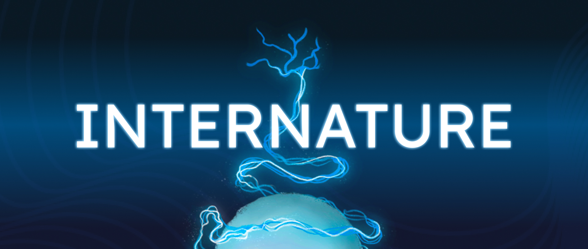
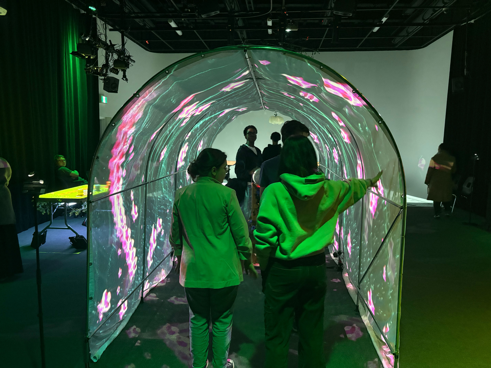
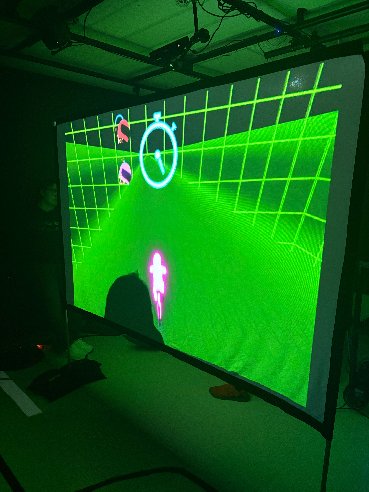
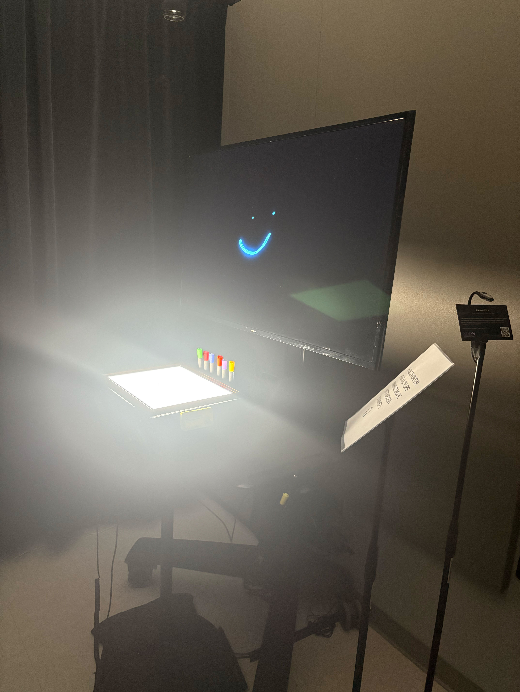
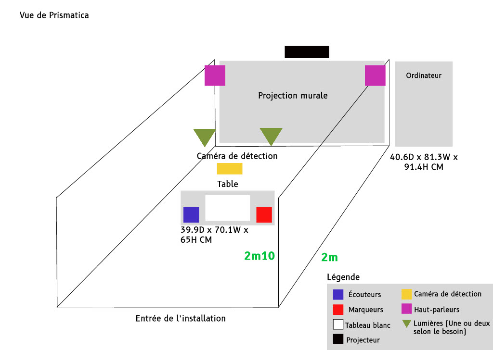
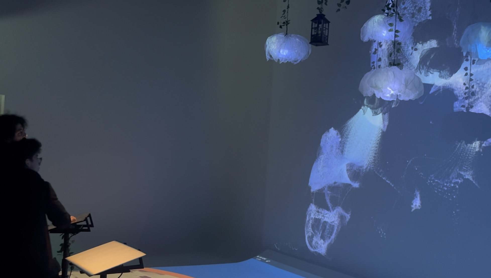
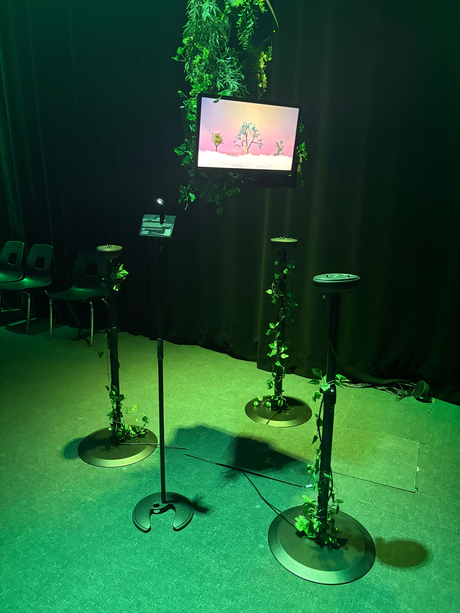
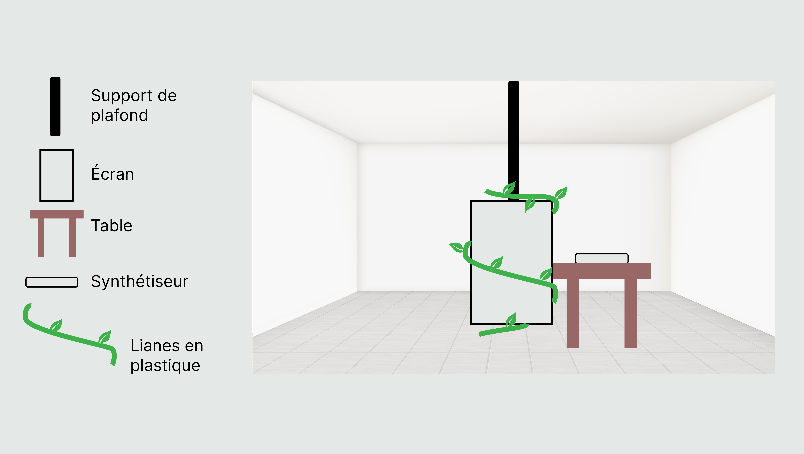
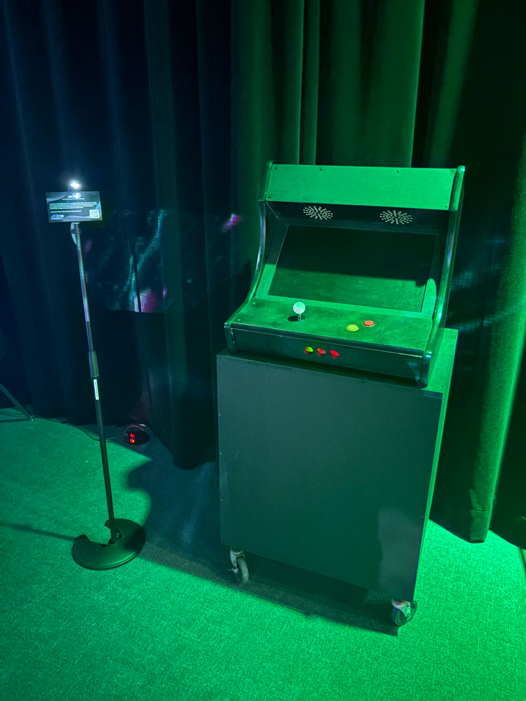

# **`Voici une présentation abrégée des projets des finissants en TIM de 2025`**

   

###### `Logo du projet Internature` 

# Internature

### Réalisé par : 
`Khaly Tia Sing`, `Isaac Fafard`, `Delphine Grenier`, `Sitmonternna Yi` & `Kenza El Harrif`

### Sentiment(s) attachée(s) au projet : 
`Liberté`, `Bonheur`, `Inspiration`, `Sérénité` & `satisfaction`

### Justification :
La `liberté` de pouvoir interagir avec la sphère qui fait évoluer  progressivement la projection immersive de la nature amène une certaine `satisfaction` et `sérénité`. Le fait que nous avons le contrôle de notre environnement ainsi que l'`inspiration` des particules qui se déplacent en harmonie dans l'espace restreint donné par le tunnel permet d'apprécier réellement la magie et le `bonheur` derrière la créativité de ce projet.

###### `Installation finale du projet Internature`

###### `Plantation de la serre pour le projet Internature`

###### `Plantation de la sphere pour le projet Internature`

###### Source du projet : (https://tprangers.github.io/internature/#/)

#

###### `Logo du projet C0NDU8` 

# C0NDU8

### Réalisé par :
`Kevin Malric`, `Ian Corbin`, `Alexandre Gervais`, `Samuel Desmeules-Voyer` & `Jérémy Roy-Coté`

### Sentiment(s) attachée(s) au projet : 
`Enthousiasme`, `Fébrilité`, `Excitation` & `Anticipation`

### Justification : 
À première vue, il est facile d'être `enthousiaste` et `fébrile` à l'idée de jouer à un jeu interactif dirigé par un vélo stationnaire, mais il est aussi simple d'`anticiper` la difficulté du jeu étant donné que celui-ci n'est pas si complexe. Cependant, le projet C0NDU8 est tout-même super `excitant` et extrèmement original.

###### `Installation finale de la projection du jeu interactif du projet C0NDU8`

###### `Installation finale du vélo pour le projet C0NDU8`

###### `Plantation du projet C0NDU8`

###### Source du projet : (https://gearshift-games.github.io/Web-C0N-DU8/#/)

#
       

###### `Logo du projet Prismatica` 

# Prismatica

### Réalisé par : 
`Vincent Delisle`, `Ikrame Rata` & `Jérémy Duverseau`

### Sentiment(s) attachée(s) au projet : 
`Vitalité`, `Appréciation` & `optimisme`

### Justification :
Je me suis senti `vivant`, au moment où j'ai expérimenté cette oeuvre. J'ai vraiment `appécié` le fait de pouvoir librement dessiner sur le tableau blanc et d'observé, par la suite, ma composition avec des effects visuel et sensorielle synchronisé. Aussi, mon regard est devenu plus `optimiste` en constatant, à mon arrivée dans la pièce, la quantité de lumière flamboyante qui était amplifiée grâce au peu de rayons qu'il y avait habituellement. 

###### `Installation finale du projet Prismatica`

###### `Plantation du projet Prismatica`

###### Source du projet : (https://pootpookies.github.io/Prismatica/#/)

#

###### `Logo du projet Luminatura` 

# Luminatura

### Réalisé par : 
`Audrey Dandurand`, `Camilia Bouatmani`, `Ihab Mouhajer`, `Justine Rousseau` & `Prethiah Rajaratnam`

### Sentiment(s) attachée(s) au projet : 
`Surprise`, `Curiosité` & `Intrigue`

### Justification : 
Face à l'installation des pupitres et l'`intriguant` décor qui lui était associé, j'ai testé, par `curiosité`, des manières de comprendre le fonctionnement du projet sans succès. Cependant, j'ai `surprenantement` découvert que l'interaction avec les pupitres changeait l'ambiance du décor et ses couleurs selon la façon dont je touchais ceux-ci et selon celui avec qui je choisissais d'interagir.

###### `Installation finale du projet Luminatura`

###### `Plantation du projet Luminatura`

###### Source du projet : (https://miaou-mafia.github.io/projet-luminatura/#/)

#

###### `Logo du projet Etheria` 

# Etheria

### Réalisé par : 
`Joshua Gonzalez-Barrera`, `Maik Hamel`, `Michael Un Dupré`, `Victor Gileau` & `Pierre-Luc Proulx`  

### Sentiment(s) attachée(s) au projet : 
`Amusement`, `Attachement` & `Esprit d'équipe`

### Justification : 
À mon avis, le principe du jeu projeté sur une table est vraiment ingénieux, dans son ensemble, car il est physiquement beaucoup plus interactif qu'un jeu vidéo et je trouve l'idée des codes-barres sur les pièces qui représentent les personnages très utile pour l'interaction avec les joueurs. Je me suis senti `attaché` au personnage comme si j'étais celui-ci et le fait que nous étions plusieurs m’a permis de m'`amuser` et de développer davantage mon `esprit d'équipe`.

###### `Installation finale du projet Etheria`

###### `Plantation du projet Etheria`

###### Source du projet : (https://ethereal-creators.github.io/Etheria/#/)

#

###### `Logo du projet Fuga` 

# Fuga

### Réalisé par : 
`Abdel Ali Djeral`, `Daniel Dezemma`, `Matis Labelle`, `Tristan Khadka` & `Yavuz-Selim Gucluer`

### Sentiment(s) attachée(s) au projet : 
`Esprit de croissance` & `Émerveillement` 

### Justification : 

###### `Installation finale du projet Fuga`

###### `Plantation du projet Fuga`

###### Source du projet : (https://escapism-fuga.github.io/Fuga/#/)

#

###### `Logo du projet Arcadia`

# Arcadia

### Réalisé par : 
`Anton Nikulin`, `Dominic Yale` & `William Beauvais`

### Sentiment(s) attachée(s) au projet : 
`Esprit de compétition` & ``

### Justification : 

###### `Installation finale du projet Arcadia`

###### `Plantation du projet Arcadia`

###### Source du projet : (https://cousi-cousa.github.io/Arcadia/#/)

#

## Cours incontournables du programme pour avoir les compétences pour créer ce genre de projet :

   1. `Oeuvres et dispositifs multimédias en exposition` (Pour découvrir, comprendre et explorer les oeuvres multimédias.)
   2. `Interactivité ludique ` (Pour expérimenter et apprendre à utiliser les logiciels afin de pouvoir réaliser un projet de façon autonome.)
   3. `Préparation au milieu de travail ` (Pour être à jour dans les techniques et technologies du domaines et développer des habitudes intemporelle pour le marché du travail.)

