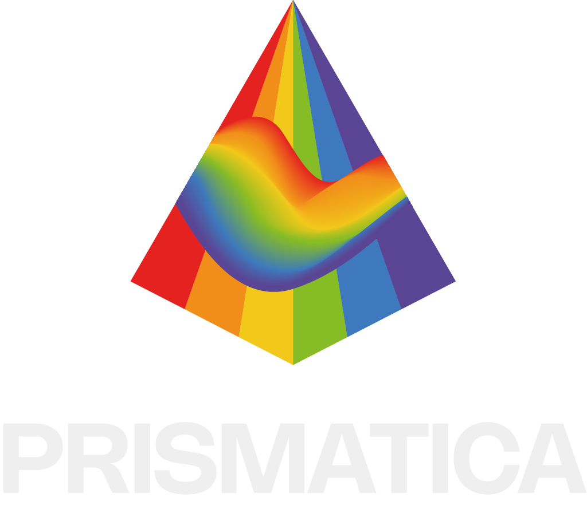

###### `Logo du projet Internature` 

# Internature

###### `Installation finale du projet Internature`
###### Source du projet : (https://tprangers.github.io/internature/#/)

### Réalisé par : 
`Khaly Tia Sing`, `Isaac Fafard`, `Delphine Grenier`, `Sitmonternna Yi` & `Kenza El Harrif`

### Sentiment(s) attachée(s) au projet : 
`Liberté`, `Bonheur`, `Inspiration`, `Sérénité` & `satisfaction`

### Justification :
La `liberté` de pouvoir intéragir avec la sphère qui fait évoluer  progressivement la projection immersive de la nature amène une certaine `satisfaction` et `sérénité`. Le fait que nous avons le controle de notre environnement ainsi que l'`inspiration` des particules qui se déplace en harmonie dans l'espace fix donné par le tunnel permet d'apprécier réelement la magie et le `bonheur` derrière la créativité de ce projet.

###### `Logo du projet C0NDU8` 

# C0NDU8

###### `Installation finale de la projection du projet C0NDU8`

###### `Installation finale du vélo pour le projet C0NDU8`

###### Source du projet : (https://gearshift-games.github.io/Web-C0N-DU8/#/)

### Réalisé par :
`Kevin Malric`, `Ian Corbin`, `Alexandre Gervais`, `Samuel Desmeules-Voyer` & `Jérémy Roy-Coté`

### Sentiment(s) attachée(s) au projet : 
`Enthousiasme`, `Fébrilité`, `Excitation` & `Anticipation`

### Justification : 
À première vue, il est facile d'être `enthousiaste` et `fébrile` à l'idée de jouer à un jeu interactif dirigé par un vélo stationnaire, mais il est aussi simple d'`anticiper` la difficulté du jeu étant donné que celui-ci n'est pas si complexe. Cependant, le projet C0NDU8 est tout-même super `excitant` et extrèmement original.
       

###### `Logo du projet Prismatica` 
###### Source du projet : (https://pootpookies.github.io/Prismatica/#/)
 

# Prismatica

### Réalisé par : 
`Vincent Delisle`, `Ikrame Rata` & `Jérémy Duverseau`

### Sentiment(s) attachée(s) au projet : 
`Vitalité`, `Appréciation` & `optimisme`

### Justification :
Je me suis senti `vivant`, au moment où j'ai expérimenté cette oeuvre. J'ai vraiment `appécié` le fait de pouvoir librement dessiner sur le tableau blanc et d'observé, par la suite, ma composition avec des effects visuel et sensorielle synchronisé. Aussi, mon regard est devenu plus `optimiste` en constatant, à mon arrivée dans la pièce, la quantité de lumière flamboyante qui était amplifiée grâce au peu de rayons qu'il y avait habituellement. 

###### `Logo du projet Luminatura` 
###### Source du projet : (https://miaou-mafia.github.io/projet-luminatura/#/)

# Luminatura

### Réalisé par : 
`Audrey Dandurand`, `Camilia Bouatmani`, `Ihab Mouhajer`, `Justine Rousseau` & `Prethiah Rajaratnam`

### Sentiment(s) attachée(s) au projet : 
`Curiosité` & ``

### Justification : 

###### `Logo du projet Etheria` 
###### Source du projet : (https://ethereal-creators.github.io/Etheria/#/)

# Etheria

### Réalisé par : 
`Joshua Gonzalez-Barrera`, `Maik Hamel`, `Michael Un Dupré`, `Victor Gileau` & `Pierre-Luc Proulx`  

### Sentiment(s) attachée(s) au projet : 
Liberté, 

### Justification : 

###### `Logo du projet Fuga` 
###### Source du projet : (https://escapism-fuga.github.io/Fuga/#/)

# Fuga

### Réalisé par : 
`Abdel Ali Djeral`, `Daniel Dezemma`, `Matis Labelle`, `Tristan Khadka` & `Yavuz-Selim Gucluer`

### Sentiment(s) attachée(s) au projet : 
Liberté, 

### Justification : 

###### `Logo du projet Arcadia`
###### Source du projet : (https://cousi-cousa.github.io/Arcadia/#/)

# Arcadia

### Réalisé par : 
`Anton Nikulin`, `Dominic Yale` & `William Beauvais`

### Sentiment(s) attachée(s) au projet : 
Liberté, 

### Justification : 
