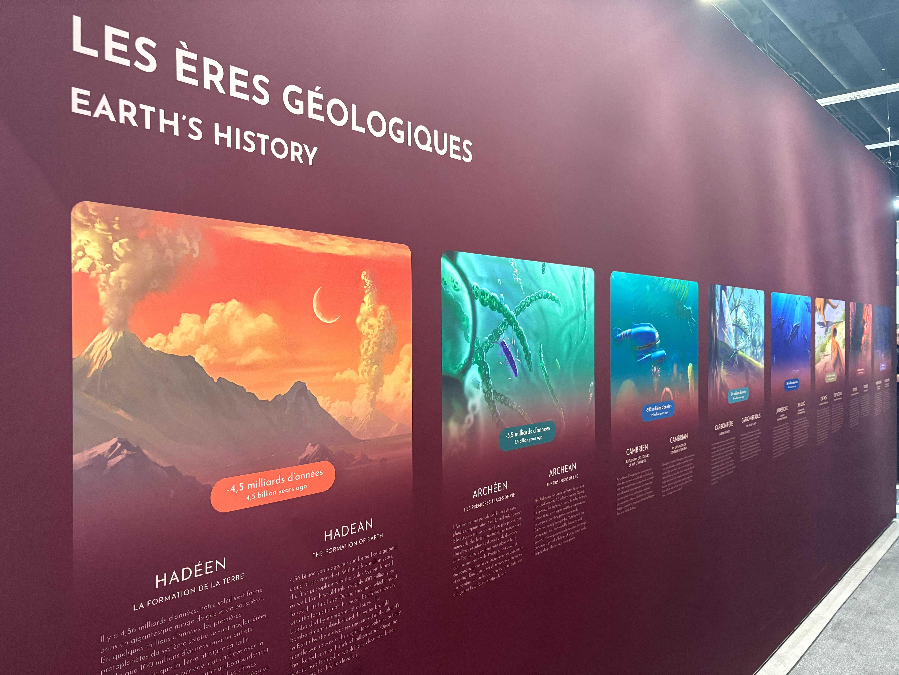
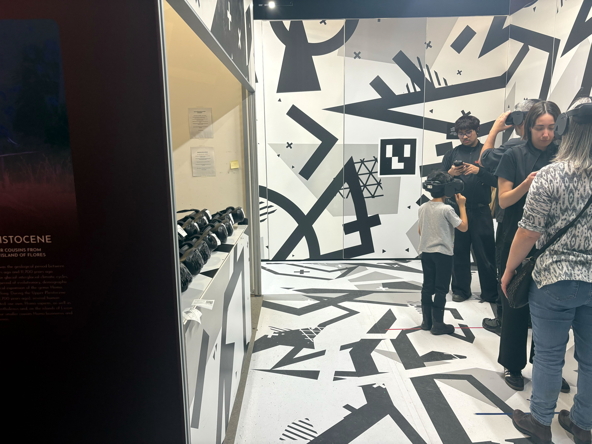
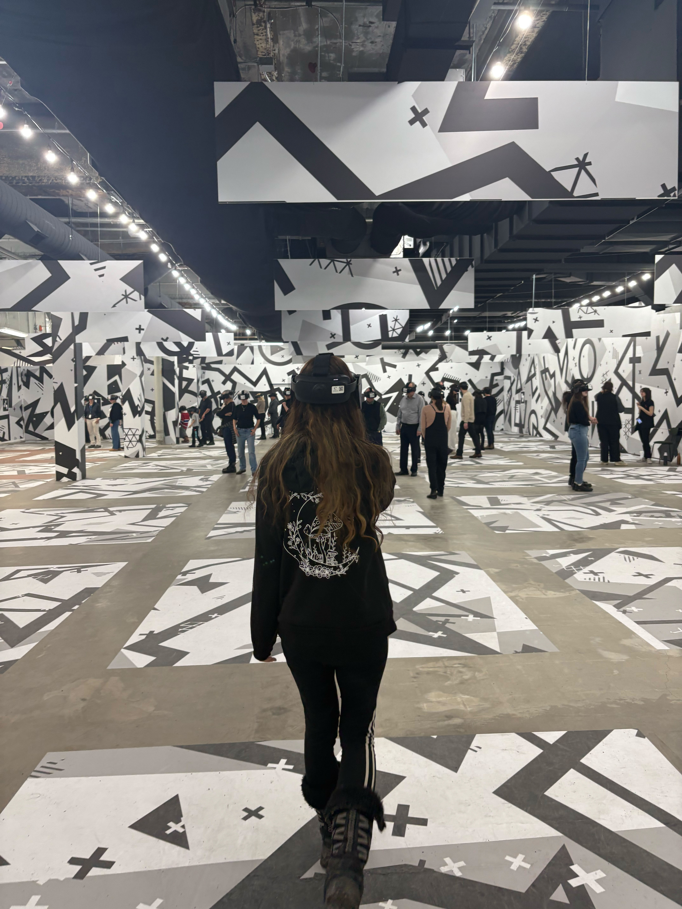
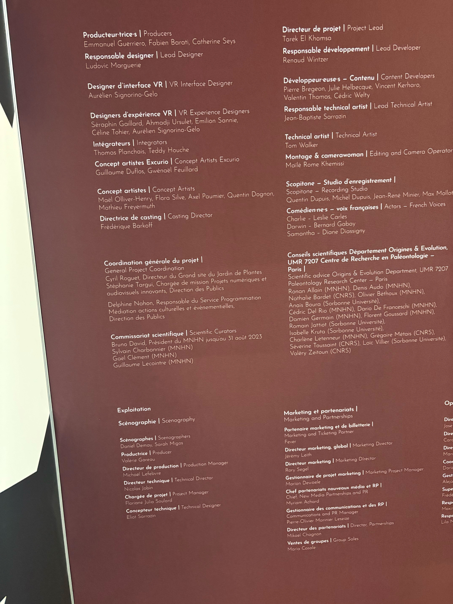
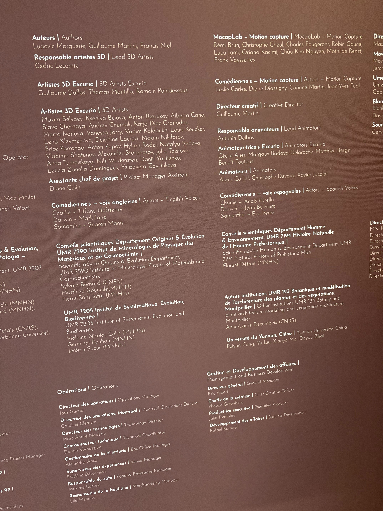
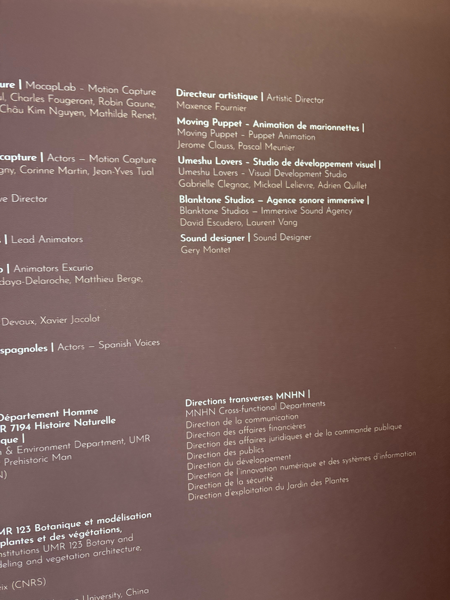
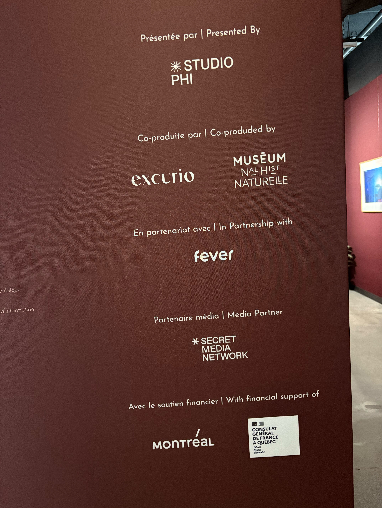
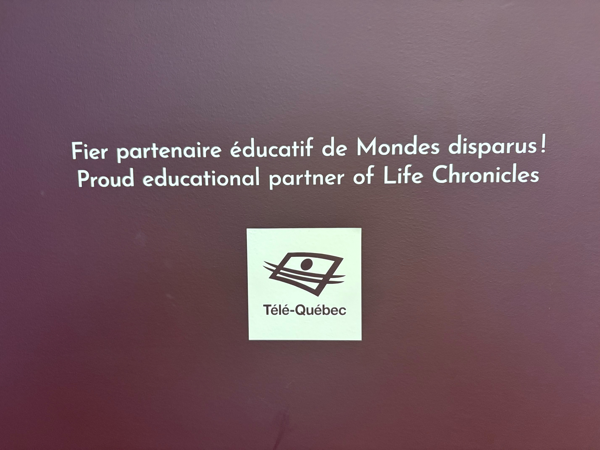

`Date de la visite :` 25 Février 2025

# Visite et expérience de l'exposition `Mondes Disparus` du `Studio PHI` à `Montréal`

#### Lien du site officiel de l'exposition : https://mondesdisparusexperience.com/
#

###### `Photo de Philippe La Brèque, du mur d'accueil de l'exposition`

###### Source: (Téléphone portable de Philippe La Brèque)

###### `Photo de Philippe La Brèque, de la façade extérieur du studio PHI (porte d'entrée pour l'exposition)`

###### Source: (Téléphone portable de Philippe La Brèque)

#

`Vidéo :` https://youtu.be/YGkZeq5Ht2U
###### `Vidéo de Philippe La Brèque, de la capsule vidéo d'introduction et d'avertissement pour l'exposition`

###### Source: (Téléphone portable de Philippe La Brèque)

#

## `Informations générales`

- Lieu de mise en exposition : `Studio PHI`
- Type d'exposition : `Intérieure & temporaire`
- Type d'installation : `Immersive, expérimentale & contemplative`
- Année de réalisation : `2025`

## Présentation de l'expérience

`Mondes disparus` est une exposition présentée sous la forme d'une expérience immersive de réalité virtuelle. C'est-à-dire qu'un monde digital nous est présenté à l'intérieur d'un casque de VR qui nous fait vivre une histoire. Celle des ères géologiques. Avant de débuter l'aventure, une capsule vidéo d'un aperçu du déroulement de l'expérience et du bon fonctionnement de celle-ci joue en boucle sur un écran. Par la suite, les casques ainsi que les explications sont expliqués pour assurer une sécurité pour tous. De plus, des repères sur les murs, membres du personnel et détecteurs intégrés à l'équipement sont présents pour diriger le chemin des gens dans la pièce en même temps que l'histoire. Le scénario est fondé sur les différentes époques (ères) géologiques qui se sont passées en Amérique du Nord.

###### `Photo de Philippe La Brèque, des ères géologiques importante présenter dans les casques VR (étapes du scénario de l'expérience projèté)`

###### Source: (Téléphone portable de Philippe La Brèque)

###### `Photo de Philippe La Brèque, de la station de casque VR de l'exposition (est aussi le point de départ de l'expérience)`

###### Source: (Téléphone portable de Philippe La Brèque)

###### `Photo de Philippe La Brèque, de la salle où des points de repères sont visible (comme les X)`

###### Source: (Téléphone portable de Philippe La Brèque)

#

## Crédits & Partenaires

###### `Photo de Philippe La Brèque, de la partie 1 du mur des crédits et partenaires de l'expositions`

###### Source: (Téléphone portable de Philippe La Brèque)

###### `Photo de Philippe La Brèque, de la partie 2 du mur des crédits et partenaires de l'expositions`

###### Source: (Téléphone portable de Philippe La Brèque)

###### `Photo de Philippe La Brèque, de la partie 3 du mur des crédits et partenaires de l'expositions`

###### Source: (Téléphone portable de Philippe La Brèque)

###### `Photo de Philippe La Brèque, de la partie 4 du mur des crédits et partenaires de l'expositions`

###### Source: (Téléphone portable de Philippe La Brèque)

###### `Photo de Philippe La Brèque, du partenaire éducatif de l'expositions`

###### Source: (Téléphone portable de Philippe La Brèque)

# Composantes de l'exposition
  - [ ] `Les nombreux casques de réalité virtuelle` --> Présentent le contenu 3D immersif ainsi que le son
  - [ ] `Les murs temporaires` --> Délimitent la zone où peut être projeté le contenu dans les casques
  - [ ] `1 écran` --> Pour la capsule vidéo d'introduction et d'avertissement avant le début de l'expérience
  - [ ] `Les nombreux repères sur l'ensemble de la pièce` --> Pour guider les capteurs des casques et leurs utilisateurs
  - [ ] `Une multitude de câbles et connecteurs` --> Afin de garantir le bon fonctionnement des composants électroniques
  - [ ] `Courant` --> Pour alimenter l'exposition en énergie
  - [ ] `Du personnel` --> Pour la supervision et la surveillance de l'expérience des visiteurs

#

### `Appréciation de l'oeuvre`

Malgré les nombreux moments de déséquilibre, d'hésitation et de vertige, mon expérience de l'exposition était réellement mémorable. Surtout grâce au contenu vraiment réaliste, aux interactions possibles avec l'environnement faunique et sous-marin généré par les développeurs, mais aussi grâce au scénario basé sur de vraies recherches et moments de l'histoire.

