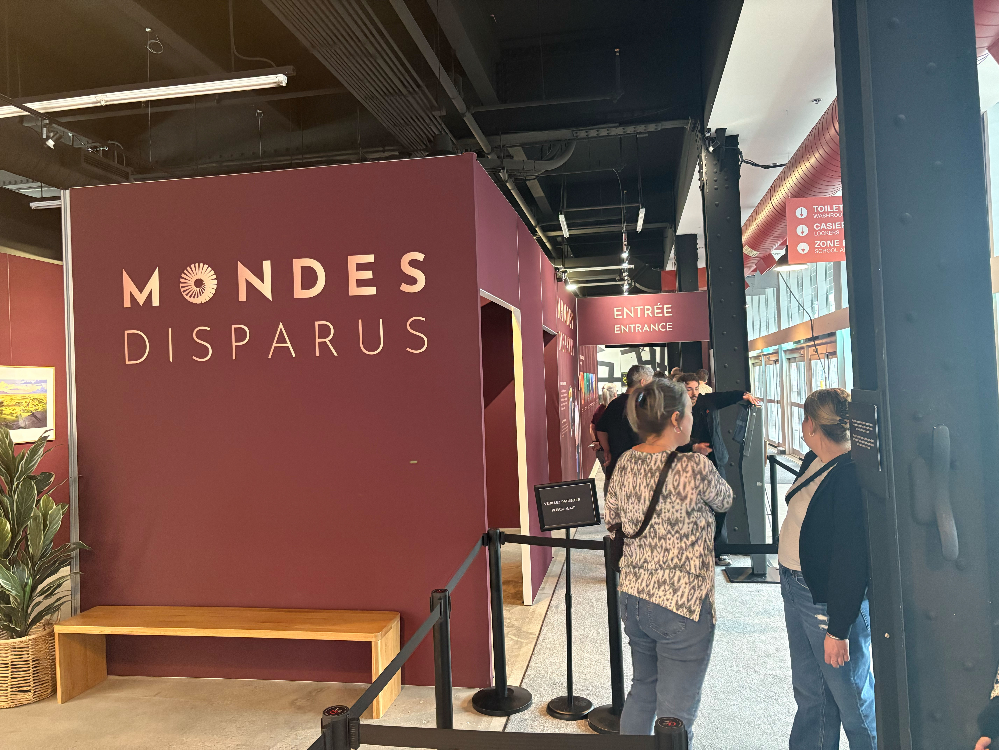
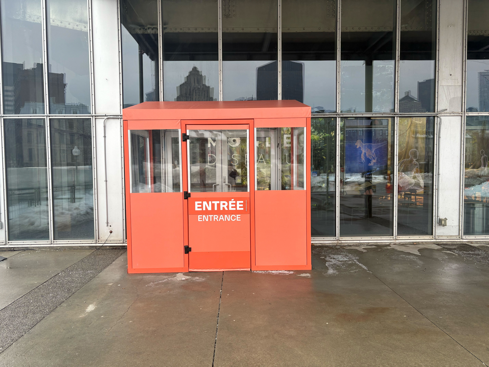

`Date de la visite :` 25 Février 2025

# Visite et expérience de l'exposition `Mondes Disparus` du `Studio PHI` à `Montréal`

###### `Photo de Philippe La Brèque, du mur d'accueil de l'exposition`

###### Source: (Téléphone portable de Philippe La Brèque)

###### `Photo de Philippe La Brèque, de la façade extérieur du studio PHI`

###### Source: (Téléphone portable de Philippe La Brèque)

#

`Vidéo :` https://youtu.be/YGkZeq5Ht2U
###### `Vidéo de Philippe La Brèque, de la capsule vidéo d'introduction et d'avertissement pour l'exposition`

###### Source: (Téléphone portable de Philippe La Brèque)

#

###### `Photo de Philippe La Brèque, du texte d'information du mur d'accueil de l'oeuvre`

###### Source: (Téléphone portable de Philippe La Brèque)

#

## `Ravel Ravel Interval`

Pour résumer `le texte du mur de présentation de l'oeuvre présenté ci-haut`, voici un court paragraphe qui explique ma compréhension de `Ravel Ravel Interval` : l'oeuvre présente l'utilisation de deux projections superposées et décalées au niveau du temps qui illustrent deux angles de vue différents des mains d'Anri Sala jouant du piano. Tout en étant synchronisée avec le son diffusé dans toute la salle par les `14 haut-parleurs`, cet effet crée une sorte de symbiose musicale pour les visiteurs.

### Ce point de vue est une observation de face afin de contempler le résultat de l'effet de superposition des 2 projections.

###### `Photo de Philippe La Brèque, du résultat de l'oeuvre dans l'angle d'observation des spectateurs`

###### Source: (Téléphone portable de Philippe La Brèque)

###### `Photo de Philippe La Brèque, du résultat de l'oeuvre dans l'angle d'observation de côté. (où l'on observe les 2 projections ainsi qu'un des deux projecteurs dans la salle)`

###### Source: (Téléphone portable de Philippe La Brèque)

###### `Photo de Philippe La Brèque, du projecteur de la projection principale`

###### Source: (Téléphone portable de Philippe La Brèque)

#

### `Informations générales`

- Lieu de mise en exposition : `Musée des beaux-arts de Montréal`
- Type d'exposition : `Intérieure & temporaire`
- Type d'installation : `Immersive & contemplative`
- Année de réalisation : `2017`

- Composantes de l'oeuvre
  - [ ] `2 Projecteurs` --> Projettent les vidéos sur les toiles
  - [ ] `2 Toiles blanches` --> Délimitent la zone où sont projetées les vidéos
  - [ ] `2 Bancs` --> Pour que les spectateurs puissent s'installer confortablement dans la salle
  - [ ] `14 Haut-parleurs` --> Pour diffuser différentes pistes audio en spatialisation
  - [ ] `3 Projecteur lumineux` --> Afin de guider
  - [ ] `1 Herse` --> Structure qui supporte les composantes de l'oeuvre, sauf les bancs
  - [ ] `1 Tapis` --> Pour réduire la résonance du son dans la salle
  - [ ] `1 multitude de câbles et connecteurs` --> Afin de garantir le bon fonctionnement des composants électroniques
  - [ ] `Courant` Pour alimenter l'oeuvre en énergie

#

### `Informations sur place`

Suite à la lecture du mur de présentation du dispositif qui se trouve à l'accueil de l'oeuvre, un long corridor sombre et presque vide présente 2 cartels d'information sur `Ravel Ravel Interval`.

###### `Photo de Philippe La Brèque, du corridor d'entrée où se trouvent 2 cartels d'information de l'oeuvre`

###### Source: (Téléphone portable de Philippe La Brèque)
#

#

###### `Photo de Philippe La Brèque, du cartel de l'oeuvre`

###### Source: (Téléphone portable de Philippe La Brèque)

#

###### `Photo de Philippe La Brèque, des crédits et remerciements de l'oeuvre`

###### Source: (Téléphone portable de Philippe La Brèque)

#

### `Appréciation de l'oeuvre`

`Intrigué` par le `corridor` qui me parut `presque vide`, j'étais déjà `enthousiaste` à l'idée de découvrir `une oeuvre donc j'ignorai l'objectif`. Une fois entré dans la `seconde pièce`, j'ai compris que des `bancs` m'attendaient afin que je puisse contempler les `2 vidéos saccadantes qui attiraient mon œil`. Après quelques minutes d'observation, j'ai trouvé la réponse à mon intrigue. L'objectif était d'`observer la superposition des deux vidéos` de façon à les visionner en `harmonie décalée` tout en `suscitant le plus de sens du corps humain possible`. L'`ingéniosité` de cette `technique` est, pour moi, `vraiment impressionnante` et `preuve du génie humain`.

