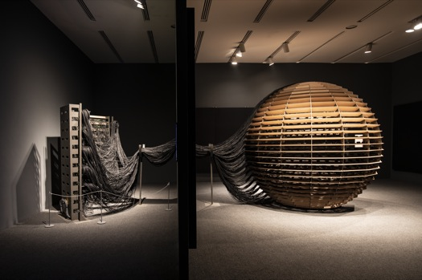

# Conférence de la présentation de l'artiste`Rafael Lozano-Hemmer` 
## Présenté par `Jade Séguela`

Durant la conférence portant sur quelques-uns des dispositifs mis en œuvre et créés par l'`artiste` `Rafael Lozano-Hemmer` ainsi que son équipe, la `registraire` et `passionnée de muséologie` `Jade Séguela` nous a conceptualisé, par l'utilisation d'une présentation `PowerPoint`, leurs `projets multimédias` les plus `marquants` et les plus `exigeants`. Seulement `2` des nombreuses œuvres de l'`ATELIER LOZANO-HEMMER` ont été `principalement abordées` et `détaillées` durant cette conférence.

#

###### `Portrait de l'artiste Rafael Lozano-Hemmer`

#

###### `Installation Sphere Packing: Bach`

###### Source: (https://lozano-hemmer.com/sphere_packing_bach.php)

#### *`Sphere Packing: Bach`*

Même si elle était la première installation présentée et qu'elle paraissait la moins complexe, celle-ci était pourtant extrêmement difficile et encombrante à mettre en place. `Sphere Packing: Bach` est une œuvre basée sur une multitude de pistes audio des compositions de `Johann Sebastian Bach` installées dans une sphère artisanale en bois de 3 mètres de diamètre où l'on les y fait jouer grâce aux nombreux haut-parleurs qui permettent une ambiance surchargée et enveloppante.

#### `Appréciation de la conférence`
