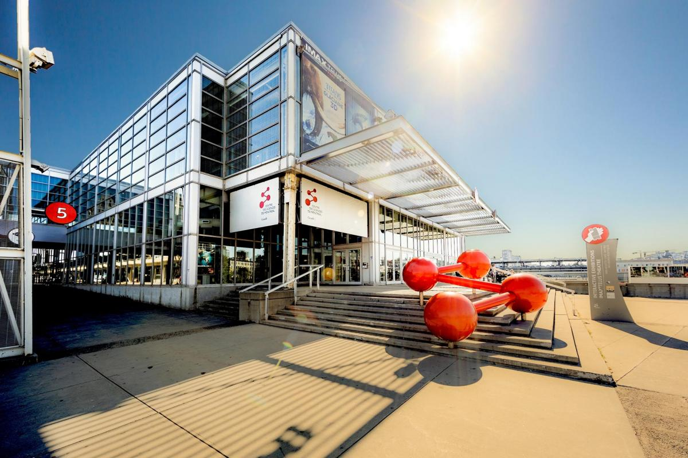
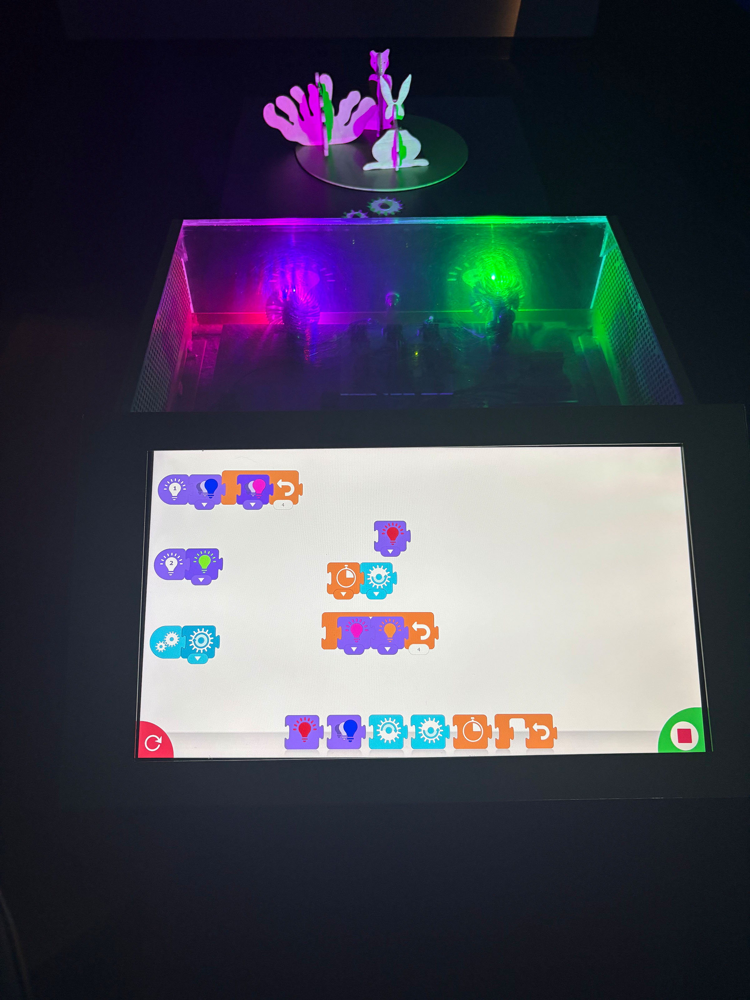
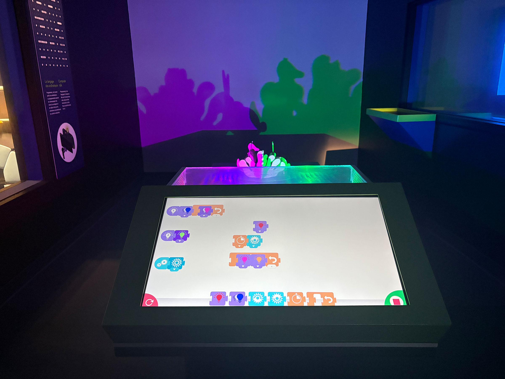
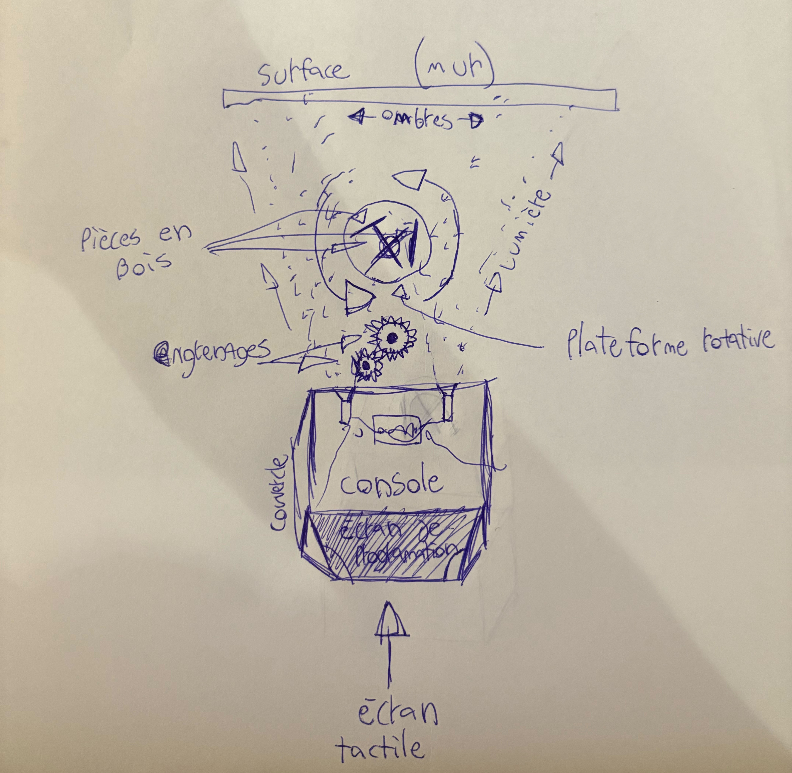
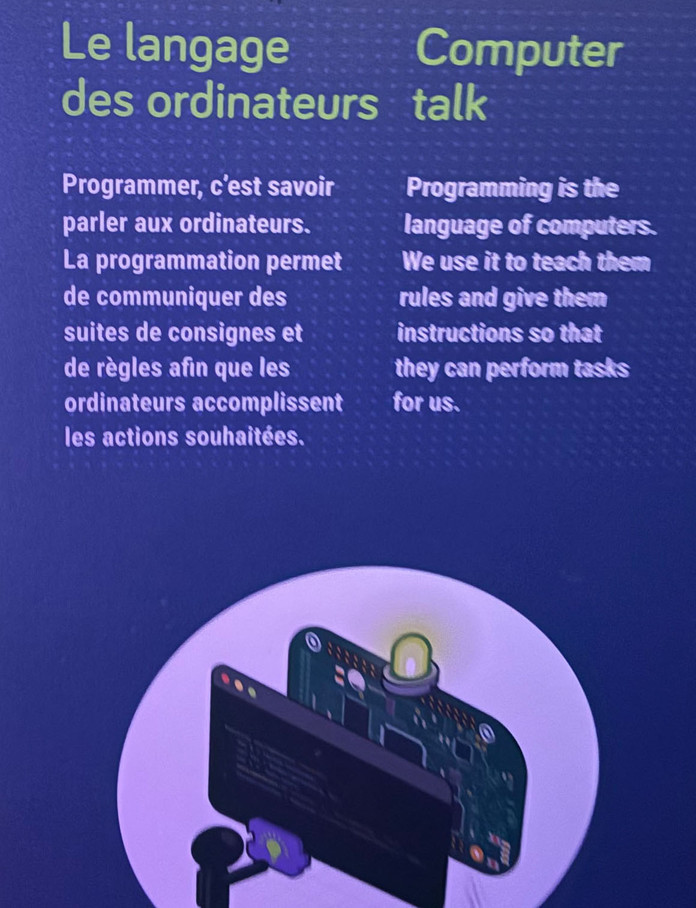
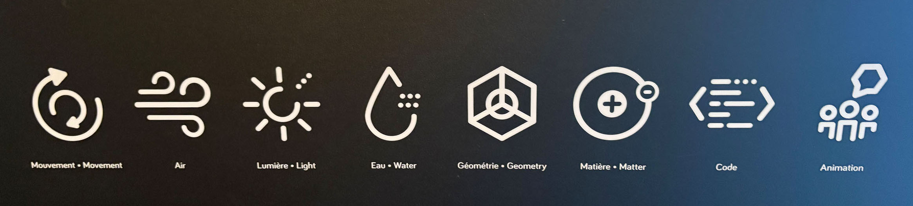

30 janvier 2025

# **EXPOSITION : Explore**


https://www.montrealsciencecentre.com/
 

# **DISPOSITIF : Carroussel d'ombre**

## Année de réalisation
N'est pas mentionnée ou écrit dans l'expositions

## Type d'installation 
*```Contemplative```* et *```interactive```*

Dans l'objectif de recherche et d'expérimentation d'un dispositif de l'exposition *```permanente```* du *```centre des sciences de montréal```*, je vous présente celui que j'ai choisi. 
 



## Technique d'ombrage avec des lumières de couleurs ainsi que les pièces en formes d'animaux
Le dispositif qui utilise de la lumière de couleurs ainsi qu'une plateforme rotative programmable, à partir de faisceaux projetés en direction de pièces de bois en forme de lapin, buisson et écureuil, est installé dans une salle isolée de la plupart de la lumière extérieure. L'objectif du placement des éléments est de pouvoir observer le résultat programmé sur l'écran tactile, par les nombreux jeux d'ombres et de néons sur les pièces de bois que l'on peut déplacer à notre guise et qui tournent sur la plateforme ronde. De plus, la projection est divisée selon les différentes lumières, ce qui multiplie et ajoute plusieurs couches d'ombres selon la disposition choisie.

*```Vidéo du dispositif en action :```* https://youtube.com/shorts/7wPxhTO4tKw

## Vue d'ensemble




## Éléments utilisés
- Pièces de bois (*```Écureuil```*, *```lapin```* et *```buisson```*)
- Console de Programmation (Pour programmer)
- Couvercle de verre (Pour protéger la console)
- Écran tactile (Pour l'intéractivité et l'intéraction du destinataire)
- Plateforme rotative (*```Moteur électrique```* et *```Plateforme métallique```*)
- Surface où le résultat est projeté (*```Mur```*)
- Électrécité (*```Cables```*, *```Courant```*, *```Autres éléments connexes```*)
- Surface adaptée à la hauteur des visiteurs (```Pour installer correctement les éléments```)
- Engrenages


## Croquis du fonctionnement selon ma compréhension du dispositif
Selon la programmation sur *```l'écran tactile```*, la *```console```* ( Protègé par un *```couvercle de verre```* ) exécute le code et projette les deux *```faisceaux de lumière```* en direction des *```pièces de bois```* qui tournent en rond sur la *```plateforme```* grâce à un petit *```moteur électrique```* ainsi que des *```engrenages```* ce qui crée l'incrustation des deux couleurs et la silhouette des pièces sous forme d'ombres sur le *```mur```*.



# Info sur place




## Principes scientifiques et techniques utilisés
Voici chacun des principes mis en oeuvre dans le *```Carrousel d'ombre```*. Oui, même l'eau !
Il faut s'hydrater dans une journée =)



## Crédits
```Liste des crédits :``` https://youtube.com/shorts/gTr0fDp636w


## Appréciation personnelle
- ```Choix du dispositif``` : La selection était plus ou moins simple. Le *```Carrousel d'ombre```* est un des seuls dispositifs qui a attiré mon attention due au fait qu'il est dans une salle fermée uniquement pour lui, qu'il est beaucoup plus complexe que les autres systèmes de l'exposition et que j'ai adoré la liberté qu'offre la programmation (choix des couleurs, l'intensité des rayons, etc.) et le déplacement des animaux en bois.  
- ```Point(s) fort(s)``` :
  1. Liberté de la disposition des éléments
  2. Beaucoup d'interactivité
  3. Très bonne visibilité de la console et de ses composantes
    
- ```Point(s) à embellir``` :
  1. Les pièces en bois peuvent être perdues ou volées
  2. Encombrant à démonter
  3. Manque d'information sur le fonctionnement et l'utilisation du dispositif

