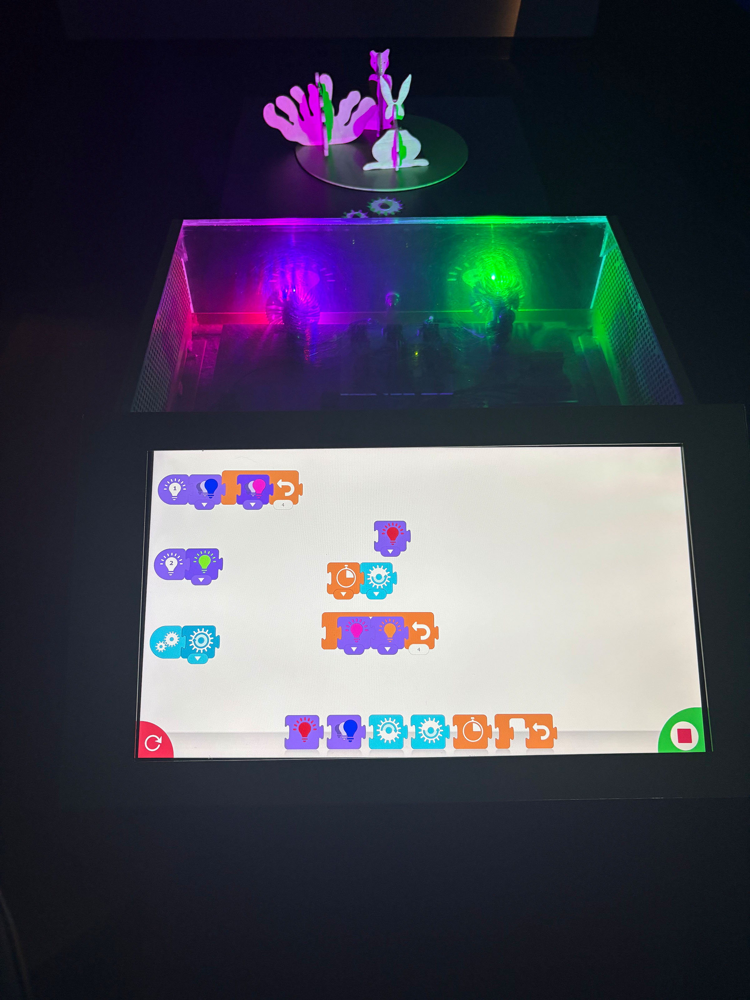
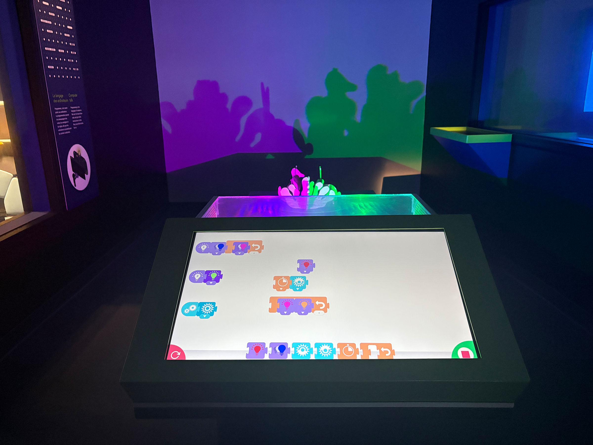

30 janvier 2025

# **EXPOSITION : Explore**

https://www.montrealsciencecentre.com/

# **DISPOSITIF : Carroussel d'ombre**
Dans l'objectif de recherche et d'expérimentation d'un dispositif de l'exposition permanente du centre des sciences

Technique d'ombrage avec des lumières de couleurs

# **DISPOSITIF : Carroussel d'ombre**

