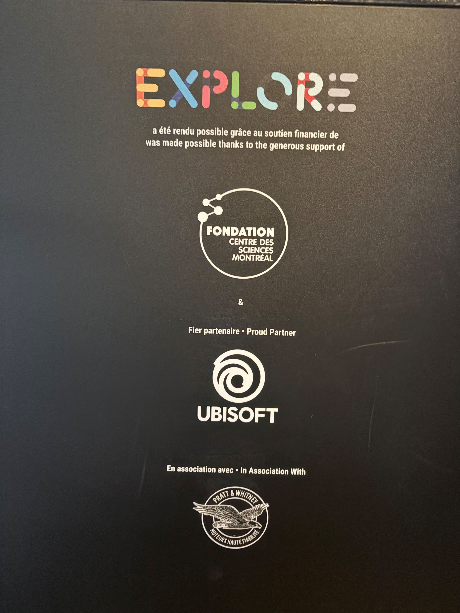

30 janvier 2025

# **EXPOSITION : Explore**


https://www.montrealsciencecentre.com/
 

# **DISPOSITIF : Carroussel d'ombre**

## Année de réalisation
*n'est pas mentionnée ou écrit dans l'expositions*

## Type d'installation 
*```Contemplative``` et ```interactive```*

Dans l'objectif de recherche et d'expérimentation d'un dispositif de l'exposition ```permanente``` du ```centre des sciences de montréal```, je vous présente celui que j'ai choisi. 
 


**Technique d'ombrage avec des lumières de couleurs ainsi que les pièces en formes d'animaux**


 
 Le dispositif qui utilise de la lumières de couleurs à partir de faisceaux projetés en direction de pièces de bois en forme de lapin, buisson et écureuille est installé dans une salle  


# **Éléments utilisé**




